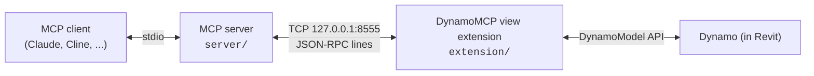

# dynamo-mcp

**Connect AI assistants to a live Autodesk Dynamo session via the Model Context Protocol.**

dynamo-mcp lets MCP clients (Claude Code, Claude Desktop, Cline, ...) inspect, edit inputs of, and run the
Dynamo graph that is currently open in Dynamo for Revit. It has two parts:

- **`extension/`** — a C# Dynamo *view extension* that runs inside Dynamo, has full access to the
  `DynamoModel` / workspace / nodes, and listens on a loopback TCP socket.
- **`server/`** — a TypeScript MCP server (stdio) that exposes tools to the AI client and forwards
  each call to the extension as newline-delimited JSON-RPC 2.0.



The tool contract lives in the server; the extension is only a bridge. If Autodesk ships a public
Dynamo MCP API later, the bridge can be swapped without changing the tools.

## Requirements

| Component | Requirement |
|---|---|
| Dynamo | Dynamo for Revit **4.1** (Revit 2027) — tested target. Dynamo 3.x (Revit 2025/2026) needs the extension retargeted to `net8.0-windows`. |
| Extension build | .NET SDK 10 (`dotnet --version` ≥ 10.0) |
| Server | Node.js ≥ 20 |

## Quick start

### 1. Build and install the extension

```powershell
.\scripts\install-extension.ps1
```

The script builds `extension/DynamoMcpExtension.csproj` against the Dynamo assemblies installed with
Revit 2027 (override with `-DynamoDir "C:\path\to\DynamoForRevit"`) and copies the result as a
user-level Dynamo package to

```
%AppData%\Dynamo\Dynamo Revit\27.0\packages\DynamoMCP\
├── pkg.json
├── bin\DynamoMcpExtension.dll
└── extra\DynamoMcp_ViewExtensionDefinition.xml
```

Dynamo for Revit names this folder after the Revit release (`27.0` for Revit 2027, `26.0` for
Revit 2026), while Dynamo Sandbox uses the Dynamo version (`4.1`); pass `-DynamoVersion` and
`-HostName` to the script accordingly. No admin rights are needed. Dynamo loads
`*_ViewExtensionDefinition.xml` files found in a package's `extra` folder. Restart Dynamo; the **Extensions** menu shows `Dynamo MCP: ON (127.0.0.1:8555)`.
Click the item to stop/start the bridge. The extension writes a log to
`%LocalAppData%\DynamoMCP\extension.log`.

### 2. Build the server

```bash
cd server
npm install
npm run build
```

### 3. Register with your MCP client

**Claude Code**

```bash
claude mcp add dynamo-mcp -- node C:/path/to/dynamo-mcp/server/build/index.js
```

**Claude Desktop** (`claude_desktop_config.json`)

```json
{
  "mcpServers": {
    "dynamo-mcp": {
      "command": "node",
      "args": ["C:/path/to/dynamo-mcp/server/build/index.js"]
    }
  }
}
```

Set `DYNAMO_MCP_PORT` in both the Revit process environment and the server environment to use a
port other than 8555.

## Tools

| Tool | What it does |
|---|---|
| `dynamo_status` | Confirms the bridge is reachable; returns Dynamo/host versions, current workspace summary, available bridge commands. |
| `get_workspace` | Nodes (id, name, category, state, warnings, input/output flags) and connectors of the open graph. |
| `get_node` | One node in detail: ports and connections, input configuration, Code Block source, messages, cached value from the last run (depth/size limited). |
| `open_graph` | Opens a `.dyn` file (manual run mode by default) and returns its node list. |
| `set_input_value` | Sets the value of an input node (Number, String, Boolean, sliders, Code Block, dropdown). |
| `run_graph` | Runs the graph, waits for `EvaluationCompleted`, returns success flag, nodes with warnings/errors and their messages, and values of nodes marked *Is Output*. |

## How it works

- Every request from the server opens a short-lived TCP connection to `127.0.0.1:8555`, writes one
  JSON-RPC 2.0 request terminated by `\n`, and reads one response line.
- The extension serves each connection on a background thread and marshals all Dynamo access onto
  the Dynamo/Revit UI thread with a 60 s timeout, so a modal dialog cannot hang the bridge forever.
- `run_graph` triggers `RunCancelCommand` (or `ForceRun` with `force: true`) and waits on the
  socket thread for `HomeWorkspaceModel.EvaluationCompleted`.
- The listener binds to loopback only. There is no authentication: anything on the same machine that
  can reach the port can run the open graph, which in Revit means running arbitrary graph logic.

## Wire protocol

Request:

```json
{"jsonrpc":"2.0","id":"1","method":"get_node","params":{"name":"Number"}}
```

Response:

```json
{"jsonrpc":"2.0","id":"1","result":{"id":"...","name":"Number","state":"Active","cachedValue":42}}
```

Errors follow JSON-RPC: `-32601` unknown method, `-32602` bad parameters, `-32000` Dynamo exception.

## Repository layout

```
extension/            C# view extension (net10.0-windows)
  Bridge/             TCP server, JSON-RPC, UI-thread context
  Commands/           One class per bridge command + serializers
  package/            pkg.json and extension definition used for the Dynamo package layout
server/               TypeScript MCP server
  src/bridge/         Socket client
  src/tools/          Tool registrations
scripts/              install-extension.ps1
```

## Roadmap

- Headless execution through a Revit add-in (run vetted `.dyn` files without the Dynamo UI).
- Offline `.dyn` tooling: validate JSON, list node library and package dependencies without Revit.
- Graph allow-list and audit log for `open_graph` / `run_graph`.
- Multi-version builds (Dynamo 3.x on .NET 8).

## License

MIT
